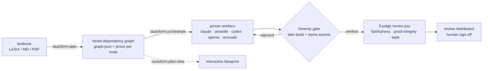

# Autoform

**An autoformalization engine for Claude Code: turn a mathematics textbook into
kernel-verified Lean 4, with every proof independently checked and every verdict
auditable.**

Autoform is a Claude Code plugin that runs the full pipeline — plan a textbook
into a tiered dependency graph, prove nodes with swappable AI backends, verify
every claimed proof against the Lean kernel, judge the result with a three-axis
review jury, and put a human in charge of final sign-off through a local review
dashboard. Its central design commitment: **no model is ever trusted about its
own proof.** A backend's "proved" is only a claim until an independent gate
rebuilds the project and audits its axioms (`sorryAx` and non-standard axioms
are rejected), so adding a new — even unknown — model backend is safe by
construction.

## How it works



- **Plan** — a two-phase pipeline reads your sources and builds a tiered DAG:
  coarse concept clusters first, then fine per-statement nodes with their own
  paraphrased prose, each mapped against Mathlib (in-mathlib / partial /
  missing). Rendered as an interactive leanblueprint with a tier toggle.
- **Prove** — a deterministic dispatch engine drains a shared task queue:
  prover workers write real Lean, iterating against build feedback. Backends
  are thin adapters behind one driver; a steering judge watches live-steerable
  backends and folds the gate's own rejection reason back as a corrective turn
  for the rest.
- **Verify** — every "proved" passes the honesty gate: the project builds
  clean, the touched declarations' axioms are audited (`#print axioms`), and
  anything beyond Lean's standard axioms — or any `sorry` — downgrades the
  claim to failed.
- **Review** — three single-axis judges score each node (faithfulness 0.40,
  proof integrity 0.40, code quality 0.20); thresholds gate a
  clean / flagged / rejected verdict. Humans review packets or use the local
  dashboard; a human verdict is immutable and always wins over the AI's.

## Quickstart

Prereqs: [Claude Code](https://claude.com/claude-code), Python ≥ 3.10, and
[uv](https://docs.astral.sh/uv/) (the MCP servers launch via `uv run` and
resolve their own deps on first start).

```text
/plugin marketplace add VivienCabannes/autoform-bot
/plugin install autoform@autoform

/autoform:install-autoform      # check/install uv, Python deps, Lean, optional Zulip
/autoform:setup                 # new Lean+Mathlib project → plan → blueprint → dashboard
/autoform:orchestrate           # launch the engine: prover workers + review jury
```

`/autoform:setup` walks you through creating a project (via the LeanProject
template, with Mathlib cache), planning your sources into `graph.json`, and
opening the review dashboard. `/autoform:set-backend` persists the default
prover backend (`max` | `aristotle` | `codex`; the `openai`/`avocado` backends
are selected per-call on `prove_node`); `/autoform:orchestrate` then drives the
formalization — autonomously, human-driven from the dashboard, or both, off one
shared queue.

## Prover backends

One MCP tool proves a node — `prove_node(graph_path, node_id, project_dir,
backend=...)` — and the driver, steerer, and honesty gate are identical for
every backend; only the adapter differs.

| backend | what it is | auth / env | steering |
|---|---|---|---|
| `claude` (default) | headless Claude Code worker on your Max subscription | your Claude login (API key scrubbed → subscription billing) | gate-fold (live judge opt-in) |
| `aristotle` | Harmonic's Aristotle prover API | `ARISTOTLE_API_KEY` + `uv sync --extra aristotle` | **in-flight** (`project.ask`) |
| `codex` | OpenAI Codex CLI | codex's own auth | gate-fold (live judge opt-in) |
| `openai` | any OpenAI-compatible endpoint | `AUTOFORM_OPENAI_BASE_URL` / `_MODEL` / `_KEY_VAR` | request/response |
| `avocado` | Meta's Muse Spark (public preset; internal fill-ins in [docs/avocado-handoff.md](docs/avocado-handoff.md)) | `MODEL_API_KEY` (overridable via `AUTOFORM_AVOCADO_*`) | request/response |

Steering is capability-aware: Aristotle accepts corrections mid-run; headless
CLIs get the deterministic **verify-gate fold** (the gate's rejection reason,
fed back verbatim as one corrective turn); request/response backends retry at
the dispatch layer. The steering judge runs on structured signals, not a timer.

## Self-reporting: formalization.yaml + usage ledger

Projects created by autoform carry a
[mathlib-initiative `formalization.yaml`](https://github.com/mathlib-initiative/formalization.yaml)
manifest (v0.3). Every prover run appends token/cost/wall-time telemetry to an
append-only ledger (`.autoform/usage.jsonl`) and refreshes the manifest's
machine-owned fields — models used, wall time, spend, token totals, sorry
counts — while everything human-written round-trips untouched. Retrofit an
existing project with `python3 scripts/formalization.py init <project-dir>`.

## The surface

**Commands** — `/autoform:setup` (end-to-end project setup),
`/autoform:orchestrate` (launch/drive the engine),
`/autoform:set-backend` (persist the prover backend; shared with the
dashboard).

**Skills** — `plan`, `plan-view`, `review` (the planning and review surfaces);
`autoform` (Mathlib conventions), `autoform-prove` (worker proof discipline),
`eval-rubrics` (the jury's rubrics); `make-project`, `install-autoform`,
`install-lean`, `workspace` (project scaffolding and triage); `zulip`
(community search).

**Agents** — a prover `autoform-worker` and an `autoform-reader`; the planning
crew (`splitter`, `mathlib-checker`, `graph-reviewer`, `content-reviewer`,
`holistic-reviewer`, `source-searcher`); and the review jury
(`faithfulness-reviewer`, `proof-integrity-reviewer`, `code-quality-reviewer`).

**MCP servers** — `autoform-prover` (the unified `prove_node`),
`autoform-aristotle` (session-level Aristotle access),
`lean-informal-planner-mathlib` (ripgrep-backed Mathlib search),
`autoform-zulip` (Zulip search; needs a `.zuliprc`), and `autoform-repl` /
`autoform-lsp` (**stubs today** — reference implementations live in
`examples/servers/`; a real pooled REPL is landing separately).

## Repository layout

```
skills/       user-invocable skills (each a SKILL.md, some with scripts)
commands/     /autoform:setup · orchestrate · set-backend
agents/       worker, reader, planning crew, review jury
servers/      MCP servers (prover, aristotle, mathlib, zulip; repl/lsp stubs)
scripts/      plan/graph tooling, dispatch engine, review UI, formalization.py
hooks/        SessionStart intro + slash-command fast-paths
docs/         pipeline architecture, usage guide, backend handoff notes
examples/     reference implementations for the remaining stubs
tests/        pytest suite (fake adapters/transports — no Lean or network needed)
```

## Development

```bash
uv run --extra dev pytest tests/         # full suite
python scripts/lint_plugin.py            # plugin-surface lint (CI runs this)
uv run --extra dev ruff check servers/   # style
```

CI lints the plugin surface (manifests, frontmatter, references, dangling-name
guard) on pushes that touch it. See [CONTRIBUTING.md](CONTRIBUTING.md) for the component
status table and how to contribute skills, agents, or server implementations,
and [docs/pipeline.md](docs/pipeline.md) for the planner's architecture.

## License

MIT © Meta Platforms, Inc. and affiliates.
