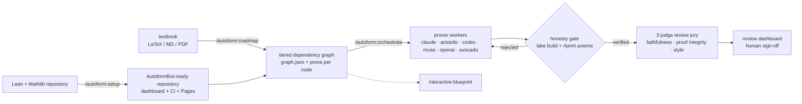
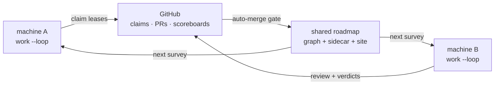

# AutoformBot

**A host-neutral autoformalization engine for Claude Code, Codex, and Muse: turn a mathematics textbook into
kernel-verified Lean 4, with every proof independently checked and every verdict
auditable.**

AutoformBot is an Agent Skills plugin that runs the full pipeline on Claude Code,
Codex, or Muse — plan a textbook
into a tiered dependency graph, prove nodes with swappable AI backends, verify
every claimed proof against the Lean kernel, judge the result with a three-axis
review jury, and put a human in charge of final sign-off through a local review
dashboard. Its central design commitment: **no model is ever trusted about its
own proof.** A backend's "proved" is only a claim until an independent gate
rebuilds the project and audits its axioms (`sorryAx` and non-standard axioms
are rejected), so adding a new — even unknown — model backend is safe by
construction.

Claude Code, Codex, and Muse share the same durable workflow contracts while
using their native plugin and subagent surfaces. See the
[host/provider architecture](docs/full-parity-architecture.md) for the boundary.

## How it works



- **Plan** — a two-phase pipeline reads your sources and builds a tiered DAG:
  coarse concept clusters first, then fine per-statement nodes with their own
  paraphrased prose, each mapped against Mathlib (in-mathlib / partial /
  missing). Rendered as an interactive leanblueprint with a tier toggle.
- **Prove** — a deterministic dispatch engine drains a shared task queue:
  prover workers write real Lean, iterating against build feedback. Backends
  are thin adapters behind one driver; a steering judge watches live-steerable
  backends and folds the gate's own rejection reason back as a corrective turn
  for the rest.
- **Verify** — every "proved" passes the honesty gate: the project builds
  clean, the touched declarations' axioms are audited (`#print axioms`), and
  anything beyond Lean's standard axioms — or any `sorry` — downgrades the
  claim to failed.
- **Review** — three single-axis judges score each node (faithfulness 0.40,
  proof integrity 0.40, code quality 0.20); thresholds gate a
  clean / flagged / rejected verdict. Humans review packets or use the local
  dashboard; a human verdict is immutable and always wins over the AI's.
- **Distribute** — with a shared GitHub repo, any number of machines run
  `autoform-worker work --loop`: git-ref leases keep them off each other's nodes,
  proofs travel as PRs with jury scoreboards, clean PRs auto-merge behind a
  machine-checked gate, and the roadmap site republishes from every merge.
  Humans steer from the dashboards, not from merge buttons.



## Install as a plugin

Prerequisites: [Claude Code](https://claude.com/claude-code),
[Codex](https://developers.openai.com/codex/), or Muse/TBH; Python ≥ 3.10; and
[uv](https://docs.astral.sh/uv/) (the MCP servers launch via `uv run` and
resolve their own deps on first start).

First clone the repository and install its dependencies:

```bash
git clone https://github.com/VivienCabannes/autoform-bot.git
cd autoform-bot
make setup
```

Then install AutoformBot into your host. For Claude Code, either install it
directly from GitHub:

```text
/plugin marketplace add VivienCabannes/autoform-bot
/plugin install autoform@autoform
```

or install the local checkout with `make install-claude`. For Codex:

```bash
make install-codex
```

For Muse/TBH:

```bash
make install-muse
```

These commands install AutoformBot as a host plugin; they do not install it
into the Lean project that you later formalize. The plugin keeps the
`autoform` identifier, so its package names and slash commands remain
`autoform@...` and `/autoform:...`.

In Muse, approve AutoformBot's hook and MCP capabilities in `/plugins` under
the Runtime tab. Muse can orchestrate the existing backends or run proofs and
jury reviews itself through the `muse` backend.

## Quickstart

Start a new task after installing or upgrading so the host reloads the plugin,
then use:

```text
/autoform:setup                 # prepare the Lean repository, dashboard, CI, and Pages
/autoform:roadmap               # sources → reviewed dependency graph + blueprint
/autoform:orchestrate           # choose backends and launch prover workers + review jury
/autoform:evaluate              # audit a corpus or benchmark a prover without mutating tasks
```

`/autoform:setup` walks you through creating a project (via the LeanProject
template, with Mathlib cache), repairing prerequisites, inspecting an existing
workspace, initializing durable state, and opening the review dashboard.
`/autoform:roadmap` then scopes the sources, builds and reviews `graph.json`,
and optionally renders the mathematical blueprint. `/autoform:orchestrate`
selects the prover backend (`max` | `aristotle` | `codex` | `muse` | `openai` |
`avocado`) and drives the formalization autonomously, from the dashboard, or
both, off one shared queue. Ask Orchestrate to persist a backend as the default
when needed. `/autoform:evaluate` runs read-only statement audits or isolated
prover benchmarks outside that durable queue.

## Prover backends

One MCP tool proves a node — `prove_node(graph_path, node_id, project_dir,
backend=...)` — and the driver, steerer, and honesty gate are identical for
every backend; only the adapter differs. Direct OpenAI/Avocado calls also
require `allow_api_egress=true` after explicit approval for that project/run.

| backend | what it is | auth / env | steering |
|---|---|---|---|
| `max` | **Claude Code (Max subscription)** — headless Claude Code worker | your Claude login (API credentials disabled → subscription billing) | gate-fold (live judge opt-in) |
| `aristotle` | Harmonic's Aristotle prover API | `ARISTOTLE_API_KEY` | **in-flight** (`project.ask`) |
| `codex` | OpenAI Codex CLI | codex's own auth | gate-fold (live judge opt-in) |
| `muse` | Muse/TBH CLI | configured Meta provider/authentication | one sandboxed run (no headless resume) |
| `openai` | **Custom API (OpenAI-compatible)** — direct Chat Completions endpoint, not the Codex CLI | `AUTOFORM_OPENAI_BASE_URL` / `_MODEL` / `_KEY_VAR` | bounded local tool loop |
| `avocado` | explicitly configured Meta-compatible deployment | configured key variable via `AUTOFORM_AVOCADO_*` | bounded local tool loop |

Muse worker settings can be overridden with `AUTOFORM_MUSE_BIN`,
`AUTOFORM_MUSE_PROVIDER`, `AUTOFORM_MUSE_MODEL`, `AUTOFORM_MUSE_PRESET`,
`AUTOFORM_MUSE_REASONING_EFFORT`, `AUTOFORM_MUSE_MAX_MODEL_STEPS`, and
`AUTOFORM_MUSE_RUNTIME_DIR`.

Check API configuration without sending project data with
`uv run python scripts/provider_check.py <openai|avocado>`. Add `--live` only to run a
temporary-marker tool-call probe.

Steering is capability-aware: Aristotle accepts corrections mid-run; resumable
Claude and Codex CLIs get the deterministic **verify-gate fold** (the gate's
rejection reason, fed back verbatim as one corrective turn); Muse and
request/response backends retry at the dispatch layer. The steering judge runs
on structured signals, not a timer.

## Self-reporting: formalization.yaml + usage ledger

Projects created by AutoformBot carry a
[mathlib-initiative `formalization.yaml`](https://github.com/mathlib-initiative/formalization.yaml)
manifest (v0.3). Every prover run appends token/cost/wall-time telemetry to an
append-only ledger (`.autoform/usage.jsonl`) and refreshes the manifest's
machine-owned fields — models used, wall time, spend, token totals, sorry
counts — while everything human-written round-trips untouched. Retrofit an
existing project with `python3 scripts/formalization.py init <project-dir>`.

## The surface

**The complete user command surface** — `/autoform:setup` (repository
installation, inspection, services, CI, and publication setup),
`/autoform:roadmap` (source scope, dependency planning, review, and visualization),
`/autoform:orchestrate` (backend selection and launch/drive the engine), and
`/autoform:evaluate` (read-only corpus audits and isolated prover benchmarks).

Mathlib conventions, proof discipline, environment repair, workspace
inspection, jury rubrics, and Zulip search are internal runbooks or MCP
capabilities invoked by the four workflows. They do not appear as extra slash
commands.

**Agents** — a prover `autoform-worker`; the planning crew (`splitter`,
`mathlib-checker`, `graph-reviewer`, `content-reviewer`,
`holistic-reviewer`, `source-searcher`). The review jury is generated directly
from the rubric files under `internal/rubrics/`, not separate agent prompts.

**MCP servers**: `lean-lsp-mcp` (stateful proof goals, diagnostics, hover,
code actions, and proof attempts) and `autoform-prover` (the unified
`prove_node`, including the Aristotle backend).
Mathlib and Zulip search are stateless: agents use Loogle, LeanExplore, the
local Mathlib search CLI, and the Zulip API on demand.

**Dashboards**: the loopback dashboard owns live agents, queues, backend
selection, cancellation, and human verdict entry. The optional GitHub Pages
dashboard is a deterministic, read-only snapshot built only from committed graph,
theorem, review, proof-status, and kernel-evidence inputs. Setup fails closed on
unclear repository visibility and never enables publication without approval.

**The distributed worker** (`./autoform-worker`, TauCetiWorker-style): many machines
advancing one shared roadmap through GitHub. One round = one work unit from the
cascade `rebase → fix-ci → fix → review → merge → progress → agents → prove`;
proofs land as marker-tagged PRs, jury verdicts land as scoreboard comments,
clean PRs auto-merge behind a machine-checked gate (a human dashboard verdict
always holds it), and merged verdicts fold deterministically back into
`review_status.json`. The `agents` stage drains every role the registry
discovers from `agents/*.md` — planner, mathlib-checker, counterexample hunter,
prior-art scout, and any project-local role — so the loop advances the whole
roadmap, not just proofs. Coordination is cooperative git-ref leases
(`refs/autoform-claims/*`) over compare-and-swap branch pushes — no server-side
setup, no Issues requirement, safe under any race. Orchestrate drives it in
distributed mode; [docs/worker-cli.md](docs/worker-cli.md) is the design
contract, with diagrams.

## Unattended operation

Fully-automated formalization is a supported mode, not a way of holding the
tool wrong. Human review is something you opt into, and every workflow runs
without it. Two switches set how far the fleet goes on its own; both default to
unattended:

| Switch | Default | Off means |
| --- | --- | --- |
| `AUTOFORM_STATEMENT_REPAIR` | on | A statement the evidence refutes parks for a person instead of being corrected against its source. |
| `AUTOFORM_DURABLE_IDENTITY` | on | Stateful worker execution is refused entirely. |

A prover failure is triaged into one of two kinds, because they need opposite
responses. A *proof* failure means the route was wrong: research a better one or
decompose the node. A *statement* failure means the formalization does not say
what the source says, so every further proof attempt is wasted. With repair on,
the escalation role rewrites the article to match its cited source and reports
`RECOVERY: REPAIRED`; the corrected node re-enters the prover on a later round
because its recovery fingerprint has moved. A statement it cannot correct from
the source is parked as `REFUTED` with the counterexample recorded. Nothing is
dropped: a node is repaired, parked with a reason, or still queued.

What holds without a human: CI re-validates the DAG, builds the project, rejects
`sorry` and unsafe axioms, and audits kernel trust on every PR; auto-merge
requires green CI, a trusted `clean` scoreboard at the exact head, roadmap-only
paths, and no hold label; claims are fail-closed leases. What nothing checks:
whether the formalization is *faithful to the mathematics you meant*. A repair
is only ever licensed by a cited source passage, and the review rubrics judge
faithfulness, but neither is a proof that the roadmap says what you wanted. That
judgment stays yours whenever you choose to make it.

## Repository layout

```
skills/          user workflows: setup, roadmap, orchestrate, evaluate,
                 agent-review, human-review, develop-plugin
internal/        non-discoverable runbooks, reference material, and jury rubrics
agents/          worker, reader, planning crew, review jury
servers/         stateful MCP servers plus shared prover/search implementation code
scripts/         plan/graph tooling, dispatch engine, review UI, formalization.py
autoform_worker/ the distributed worker CLI (rounds, claims, scoreboards, PRs)
docs/            maintained architecture, usage, release, and worker contracts
tests/           deterministic suite, fixtures, and optional live smoke tests
```

## Development

```bash
uv sync --extra dev --extra zulip
uv run python -m pytest -q               # full suite
python3 scripts/lint_plugin.py           # plugin-surface lint (CI runs this)
uv run ruff check scripts servers tests skills
make demo PYTHON="uv run python"
```

CI runs the deterministic suite and workspace fixture on Python 3.10–3.14,
plus Python and plugin-surface lint. These checks validate shared contracts without
paid credentials; they do not establish that a particular host login, CLI
version, or provider account works. See [CONTRIBUTING.md](CONTRIBUTING.md) for
the component status table, [docs/pipeline.md](docs/pipeline.md) for the
planner's architecture, and [docs/pilot-testing.md](docs/pilot-testing.md) for
the required live-host and failure-drill release checklist.

## License

MIT © Meta Platforms, Inc. and affiliates.
