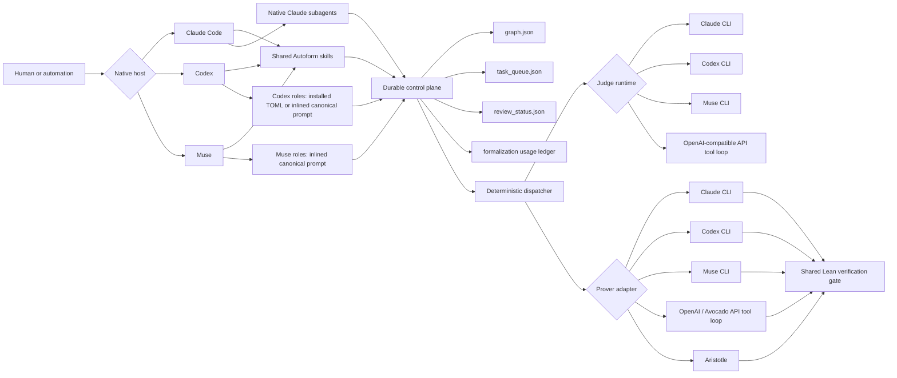

# Full-parity architecture

Status: implementation contract

Autoform supports three distinct things that must not be conflated:

1. **Agent hosts** run the interactive workflow: Claude Code, Codex, and Muse.
2. **Model providers** supply headless inference: Anthropic, OpenAI-compatible
   endpoints, and Meta's Avocado deployment.
3. **Specialist provers** solve Lean tasks through their own service: Aristotle.

Claude, Codex, Muse, and Avocado are therefore not interchangeable command-line
programs. Claude, Codex, and Muse are hosts with skills, subagents, MCP, and
permissions. Claude and Codex expose resumable headless sessions; stable Muse
currently exposes one-shot headless runs. Avocado is an OpenAI-compatible model
endpoint and needs Autoform's bounded local tool loop when it is used without a
separate agent host.

## Design goals

- The same durable graph, queue, review sidecar, usage ledger, rubrics, and kernel
  verification gate are authoritative on every host.
- Claude, Codex, and Muse keep their native skill, MCP, and subagent capabilities.
- Every provider is selected explicitly. Unknown names fail closed.
- Headless jury results use one JSON Schema contract.
- A provider never receives files implicitly. API-backed agents see only content
  returned by the bounded tools they call.
- Proof claims are never trusted. A clean Lean build, forbidden-token scan, and
  axiom audit remain the final gate.
- Unsafe host permission bypass is opt-in, visible, and unnecessary by default.
- Existing projects remain resumable; full parity does not introduce a second
  graph or queue format.

Non-goals:

- Making a request/response API endpoint emulate every UI feature of an
  interactive coding host.
- Depending on an undocumented Meta endpoint or model name.
- Hiding meaningful billing, credential, sandbox, or data-egress differences.

## System boundary



The deterministic dispatcher owns queue transitions and jury persistence.
Interactive hosts own planning and proof-recovery judgment. Subagents return
proposals; `scripts/merge_node.py` remains the only graph writer.

## Compatibility layers

### 1. Shared artifact layer

These artifacts are provider- and host-neutral:

- `graph.json` and `informal_content/`
- `task_queue.json` and `agents_status.json`
- `review_status.json`
- `formalization.yaml` and the append-only usage ledger
- rubric JSON and score thresholds
- prover events, `ProofResult`, steering capability, and verification results

Every writer must use the existing lock and atomic-replace discipline. No host
may persist a private verdict format.

### Dashboard publication boundary

Autoform has two dashboard surfaces over different trust boundaries:

- The loopback dashboard is operational. It reads live agent and queue state and
  may enqueue work, select a backend, cancel queued work, and record human
  verdicts.
- The optional GitHub Pages dashboard is a deterministic read-only export of
  committed graph structure, theorem content, proof status, review verdicts, and
  kernel evidence. It contains no queue, agent, log, provider, credential,
  reviewer-identity, or local-path data.

`scripts/export_github_dashboard.py` constructs the public snapshot from an
explicit allowlist and writes a self-contained site. The generated Pages
workflow pins both its official actions and the Autoform exporter revision.
Publication configuration is opt-in and fails closed when repository visibility
or private Pages access control is unclear.

### 2. Native interactive host layer

Agent Skills are the canonical workflow surface. Claude Code now treats legacy
commands and skills as the same user-facing concept, Codex installs plugin
commands as skills, and Muse registers native commands that load the same three
canonical `SKILL.md` files. Autoform consequently ships `setup`, `roadmap`, and
`orchestrate` without maintaining host-specific prompt copies.

Claude consumes plugin agents from `agents/*.md`. Codex project agents are
materialized into namespaced `.codex/agents/autoform_*.toml` files by
`scripts/install_host_agents.py`. The generated files contain the same role
instructions and inherit the user's selected model unless an explicit mapping is
requested. Installation preflights every collision before writing, removes only
obsolete Autoform-marked files, and never overwrites user-managed agents.

Host-neutral skill wording uses "spawn a native subagent" and a role name. On
Claude this means its Agent/Task surface; on Codex it means the native subagent
tools. Codex surfaces do not all expose custom-role selection, and a project role
installed during the current task may not be discovered until a new
project-rooted task starts. Therefore the executable fallback is to spawn a
generic native Codex subagent with the complete canonical `agents/<role>.md`
instructions inlined. Generated TOML is a discovery optimization, not the only
role contract. The workflow must not shell out to another interactive host merely
to simulate delegation.

Muse's plugin manifest does not expose an agents capability. Muse therefore uses
the same mandatory fallback: a generic native subagent receives the complete
canonical role prompt plus absolute plugin and project paths.

### 3. Deterministic headless layer

The dispatcher supports a separate prover backend and judge backend:

```text
--backend       max | aristotle | codex | muse | openai | avocado
--judge-backend claude | codex | muse | openai | avocado
```

This separation is deliberate. A project can, for example, prove with Avocado
and review with Codex. Backend lookup is exact; a misspelling is an error rather
than an implicit Claude run.

Claude, Codex, and Muse headless judges receive the same JSON Schema. Claude uses
`--json-schema`; Codex uses `--output-schema` and a last-message file; Muse
receives the schema in its isolated read-only headless prompt and returns it in
the terminal JSONL event. API judges use the OpenAI-compatible tool loop and the
same schema in the prompt/response contract.

The selected jury provider also handles the rare model-judged live-steering
signal for an in-flight prover. Deterministic trigger corrections and
verification-gate folds remain model-free. This prevents Aristotle under Codex
or an API deployment from acquiring a hidden Claude dependency.
The standalone `prove_node` MCP defaults model-judged live steering off for the
same reason; orchestration supplies the selected provider explicitly.

### 4. OpenAI-compatible tool loop

OpenAI and Avocado use Chat Completions function calling. The local executor
offers a small, auditable capability set:

- read a project-relative file;
- list or search project files;
- write a project-relative Lean file for prover runs only;
- run an allowlisted Lean command without a shell.

All paths are resolved under the project root after following existing symlinks.
Secret-like project paths (`.env*`, private-key formats, credential files,
`.git`, and `.ssh`) are excluded from read/list/search tools. Escapes, absolute
paths, oversized input/output, unapproved commands, excess turns, and wall-clock
overruns are rejected. Jury runs receive read-only tools. Prover runs may write
Lean files; the shared driver records pre-write bytes and restores them whenever
the run is not accepted, including an honest provider failure and a verification
rejection.

Lean elaboration is itself programmable, so the verification gate scans every
provider-touched source before invoking Lean and rejects execution-capable forms
that proof workers do not need (`run_cmd`, `initialize`, custom
elaborators/macros/syntax, native execution, foreign declarations, compile-time
file inclusion, and related directives). The fixed axiom probe is generated by
Autoform, not by a provider.

An endpoint that ignores or does not implement tool calls retains **sample
mode**: it can return a complete fenced Lean file, which is landed and verified.
That is compatibility, not agentic parity, and is reported as such.

## Contracts

### Jury result

```json
{
  "type": "object",
  "additionalProperties": false,
  "required": ["score", "reasoning"],
  "properties": {
    "score": {"type": ["integer", "null"], "minimum": 0, "maximum": 5},
    "reasoning": {"type": "string", "maxLength": 2000},
    "error": {"type": "string"}
  }
}
```

A null score is an abstention. Unparseable output, timeout, and process failure
are also abstentions and can never improve a jury verdict.

### Provider resolution

Configuration precedence is:

1. explicit constructor or CLI argument;
2. provider-specific `AUTOFORM_<PROVIDER>_*` environment variable;
3. generic `AUTOFORM_OPENAI_*` environment variable for compatible APIs;
4. documented public preset.

The credential configuration contains the **name** of an environment variable,
not the secret. Secrets are read only when a request starts and are never placed
in prompts, events, logs, queues, or ledgers.

The public Meta Model API is OpenAI-SDK compatible, but Autoform cannot verify a
private Avocado deployment's URL, model id, authentication, or tool-call support.
Those remain required environment overrides and a startup capability check must
surface mismatches before queue work is claimed.

Configuration and capability do not imply data-egress consent. Before every real
project/run that uses an API provider, orchestration displays the provider and
base URL host, identifies the project material its tools may return, and obtains
explicit approval. If prover and judge use different API providers, each is
checked and approved independently. The dispatcher requires a matching
repeatable `--allow-api-egress` flag, making consent an ephemeral process
capability rather than a side effect of global backend configuration. A direct
`prove_node` MCP call likewise requires `allow_api_egress=true`; its caller must
obtain the same approval first.

### Permissions

Safe defaults:

- Codex headless workers: `--sandbox workspace-write`
- Codex judges: `--sandbox read-only`
- Claude headless workers: `--permission-mode dontAsk` with file-edit tools and
  narrowly scoped Lean/search/git Bash rules
- Claude judges: read-only tools
- API judges: read-only local tool executor
- API provers: project-rooted Lean writes and allowlisted Lean commands

Claude headless processes load only user settings, disable hooks and slash
commands, and use an explicit MCP configuration. This excludes
repository-controlled settings while retaining Claude Max subscription/keychain
authentication; `--bare` would disable that authentication path.

`AUTOFORM_UNSAFE_FULL_ACCESS=1` is the only supported way to request the hosts'
dangerous bypass flags. The dispatcher prints that mode prominently.

These defaults reduce authority; they are not an operating-system security
boundary for hostile Lean projects. Lean elaboration and project build scripts
can execute code. The API adapter scans model-written content before exposing it
to `run_lean`, and the independent gate scans every provider-touched file before
its own build. A Claude or Codex coding worker can still invoke Lean while it is
iterating, before that final gate. Run untrusted repositories inside an external
VM/container or other sandbox whose boundary does not depend on the agent host.

## Failure semantics

- Missing CLI, credential, model, or provider capability: fail before claiming
  queue work where possible.
- Unknown backend: fail closed.
- Judge timeout or malformed result: abstain; never synthesize a score.
- All judges abstain: task fails and no AI verdict is written.
- Prover failure: open ordered proof recovery. A durable input fingerprint
  blocks another prover call until the statement, strategy, dependencies, Lean
  file, or backend changes.
- Honest API failure or verification failure: restore API-written files.
- Host crash: the next dispatcher sweep requeues stranded work.
- Partial orchestration: durable graph/queue state is authoritative on resume.

## Validation matrix

| Surface | Static | Fake/injected | Local smoke | Live opt-in |
|---|---:|---:|---:|---:|
| Shared skills/manifests | yes | n/a | Claude/Codex plugin validation | n/a |
| Codex role installer/inlining | yes | yes | isolated project install | native spawn |
| Claude CLI judge | args/schema | fake process | CLI help/version | one rubric |
| Codex CLI judge | args/schema | fake process | CLI help/version | one rubric |
| OpenAI/Avocado loop | schemas/security | fake transport | loopback HTTP → real kernel | private capability probe |
| Every prover | contract | fake adapter | import/build | kernel-gated proof |

CI never requires paid credentials or an external model endpoint. When Lake is
available, local smoke tests write only to temporary Lean projects. Credentialed
live tests are explicit; see `pilot-testing.md`.

## Tradeoffs

- Generated Codex role files are less elegant than plugin-bundled agents.
  Project-level `.codex/agents` is documented, while prompt inlining covers
  native spawn surfaces that do not expose custom-role selection. The fallback
  can be removed only when Codex documents universally available role selection
  or plugin agent packaging.
- A local API tool loop is more code than a single completion call, but it is the
  only way for a model-only endpoint to inspect and iterate on Lean without
  pretending it is a coding host.
- Native Claude and Codex event streams remain adapter-specific. Normalizing
  them at the `Event` boundary avoids throwing away useful host behavior.
- Safe permission defaults may expose previously hidden assumptions. That is a
  desired migration cost; bypass remains an explicit escape hatch.

## Authoritative host references

- Codex subagents and project agent TOML:
  <https://developers.openai.com/codex/agent-configuration/subagents>
- Codex non-interactive mode and structured outputs:
  <https://developers.openai.com/codex/non-interactive-mode>
- Codex plugin-bundled hooks:
  <https://developers.openai.com/codex/hooks>
- Claude Code subagents:
  <https://code.claude.com/docs/en/subagents>
- Claude Code skills and legacy commands:
  <https://code.claude.com/docs/en/slash-commands>
- Claude Code headless structured output:
  <https://code.claude.com/docs/en/headless>
- OpenAI Chat Completions tools:
  <https://platform.openai.com/docs/api-reference/chat/create>
- Meta's OpenAI-SDK-compatible model API announcement:
  <https://ai.meta.com/blog/llamacon-llama-news/>
