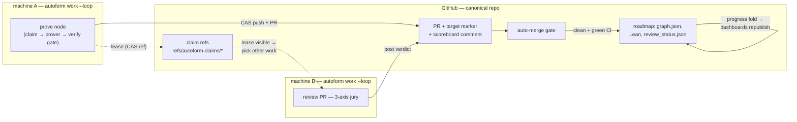
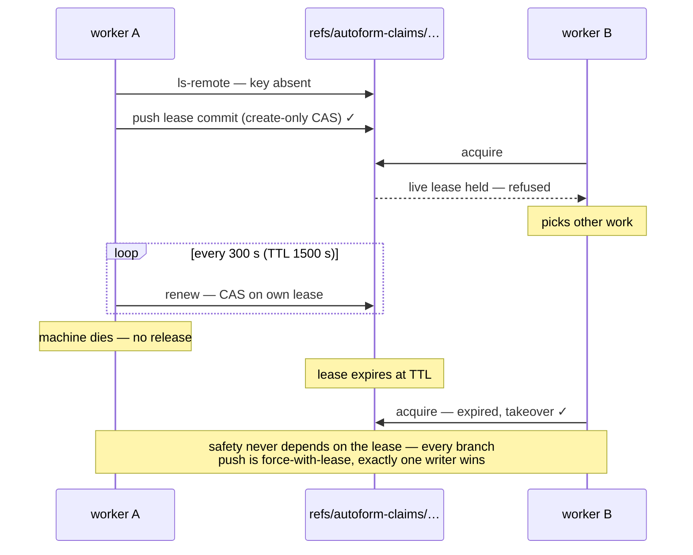
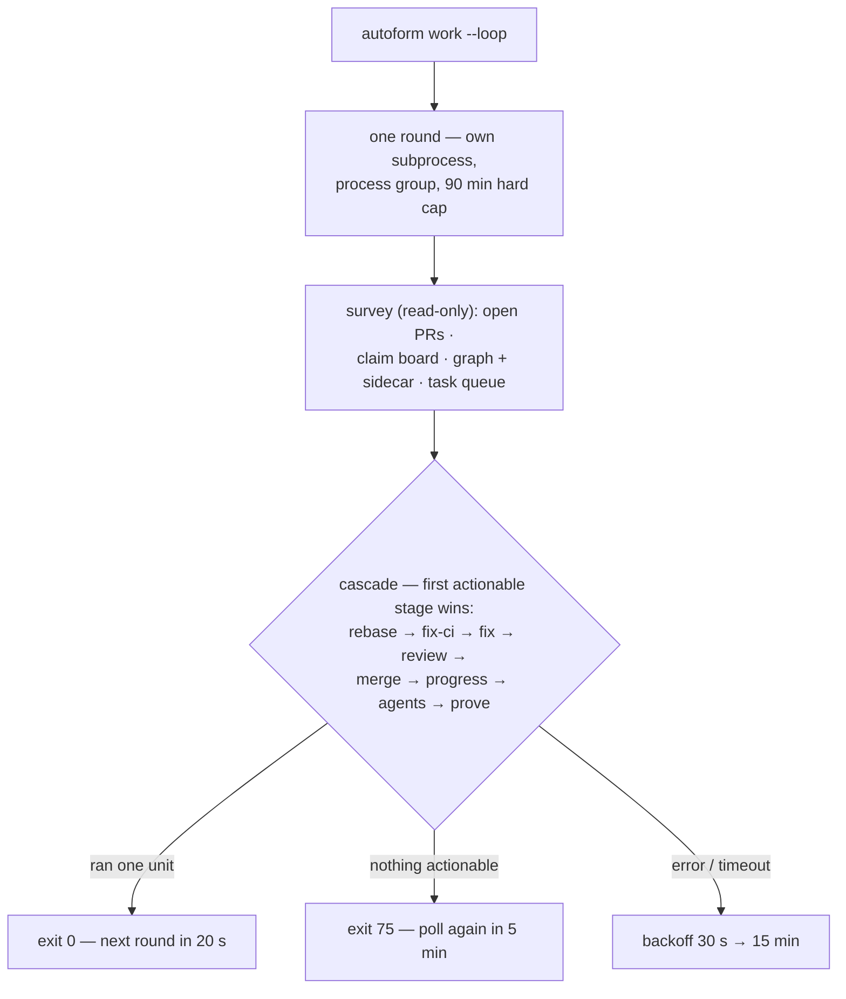
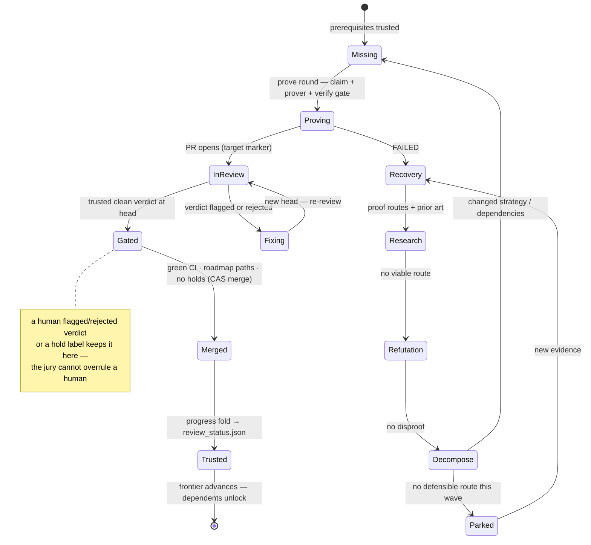

# The Autoform Worker CLI (`autoform`)

*The distributed-coordination layer: how many machines advance one roadmap.*

Modeled on Kim Morrison's TauCetiWorker (`kim-em/TauCetiWorker`), which coordinates
AI workers advancing the TauCeti library. This document is the design contract; the
implementation lives in `autoform_worker/`.

## Problem

Autoform's local dispatcher is intentionally single-machine: `fslock` advisory
locks, one `dispatcher.lock` lease per project, and a local `task_queue.json`.
Multiple people running against the *same* formalization project (a shared GitHub repo
holding `graph.json`, `wiki/nodes/`, `kernel/`, `review_status.json`, and the
Lean sources) would collide: two machines proving the same node, review state
diverging per clone, no shared progress view.

## Answer — GitHub is the coordination substrate

Three mechanisms, layered exactly as TauCeti layers them (its `COORDINATION.md`
distinguishes `[HARD]` safety from `[COOP]` throughput):

1. **[HARD] Compare-and-swap branch writes.** Every push the worker makes is
   `git push --force-with-lease=<ref>:<observed-oid>` — GitHub's atomic ref update
   guarantees exactly one writer wins. An empty expected OID means *create-only*.
   Nothing the cooperative layer gets wrong can corrupt a branch.
2. **[COOP] Git-ref lease claims.** A claim is a custom ref
   `refs/autoform-claims/<key>` in the claims repo pointing at an orphan commit
   (empty tree) whose commit message is the lease JSON. Acquire/renew/release are
   all CAS pushes of that ref, so claims inherit git's atomicity — and work on any
   git host with **no server-side setup and no Issues requirement** (GitHub forks
   have Issues disabled by default; this survives that). Claims are *cooperative*:
   losing one never corrupts anything — it only means someone may duplicate work.
   Claim errors fail open with a warning, never block a round.
3. **[COOP] Scoreboard comments.** Review verdicts for a PR live *on the PR* as a
   comment carrying `<!--autoform-scoreboard-->` plus machine-readable
   `<!--autoform-meta:v1 {...}-->` JSON (head-SHA-scoped). The committed
   `review_status.json` sidecar is updated deterministically from merged PRs'
   scoreboards by the `progress` unit — so every clone converges to the same
   sidecar without merge conflicts.



### Lease schema

```json
{"schema": "autoform-claim/v1", "owner": "<worker-id>", "host": "<hostname>",
 "pid": 12345, "acquired_at": 1690000000, "expires_at": 1690001500,
 "resource": "<key>", "note": ""}
```

Keys: `author/<slug>-<sha1[:8]>` for proving a node (derived from the free-text
node id — `autoform claim acquire --node "<id>"` derives it canonically),
`branch/<pr>` (rewriting a PR head), `progress` (the global progress/publication
unit). TTL 1500 s, heartbeat renewal every 300 s while a unit runs; an expired
lease may be taken over. The claims repo defaults to the project's canonical repo
(`AUTOFORM_CLAIM_REPO` overrides — point it anywhere all collaborators can push,
e.g. one member's fork).

The protocol under contention — and why a crashed machine never wedges anyone:



## Work units

One round = one survey pass + at most one executed unit, first actionable stage
wins (TauCeti's cascade). Detection is a single pass over `gh pr list --json` +
the local graph/sidecar + the claim board.



| Stage | Candidate | Execution |
|---|---|---|
| `rebase` | own open PR with `mergeable == CONFLICTING` | host agent (claude/codex) with `prompts/rebase.md`; harness pushes via CAS |
| `fix-ci` | own open PR with failing checks | host agent with `prompts/fix-ci.md` |
| `fix` | own open PR whose scoreboard (at head) has a blocking verdict | host agent with `prompts/fix.md` |
| `review` | open non-draft autoform PR from a trusted author, checks not failing/pending, head not scoreboarded | deterministic: checkout head, run the 3-axis jury (`judge_runtime`), post scoreboard |
| `merge` | PR with a genuine CI `success` + a trusted `clean` scoreboard at the exact head, allowlisted paths, no hold label, no human flag | deterministic: `gh pr merge --squash --match-head-commit` (merge-time CAS). A head with **no** checks never merges (`--merge-without-ci` is the explicit opt-out) |
| `progress` | merged autoform PRs newer than the last fold | deterministic: fold scoreboards → `review_status.json`, CAS-push (the Pages workflow republishes), sync proof-recovery issues |
| `agents` | a machine-local queued task whose kind the role registry knows (planner, mathcheck, graphreview, contentreview, counterexample, priorart, holistic, proof recovery, …) | spawns the host CLI with that role's own Markdown body; the role's declared write paths are enforced before curation is CAS-pushed to the default branch |
| `prove` | eligible graph node: tier-2, not in Mathlib, unproved/defective, prerequisites trusted, unclaimed, no open PR for it | claim the author lease, branch, reuse `dispatch_runner.run_worker()` (spec build + prover driver + verification gate + usage ledger), commit, CAS-push, `pr create` with target marker |

`prove` is deliberately last: it is the expensive, work-generating stage; tending
existing PRs always comes first, and `agents` runs planning/checking/refutation
roles before new proofs so compute goes into a vetted roadmap. Every mutating
stage must leave a visible GitHub mark (new head OID, new comment, a merge, or a
new PR) — a round that claims success without one exits `75` (no-progress),
TauCeti's guard against silent burn.

Attempt budgets (persisted in worker state): fix 3 per head, fix-ci 3 per head +
5 per PR, rebase 3 per PR, review errors 3 per PR, merge 3 per PR, and agent
execution failures 3 per (kind, node). Proof attempts are evidence-gated instead
of count-capped: a failed proof opens ordered recovery, and the next attempt
requires a changed durable input fingerprint. Provider-infra failures
(5xx/429/transport) refund the attempt rather than burning it.

## Where humans sit in the loop

Not on a merge button. The two human surfaces are the **static roadmap site**
(published from committed state — graph structure, theorem content, proof
status, review verdicts, kernel evidence) and the **local review dashboard**
(live agents, queues, node packets, and human verdict entry). Everything a
human wants to *say* to the system is said there:

- recording a `flagged`/`rejected` verdict on a node **holds the merge gate**
  for its PR — the human slot is immutable to machines, so the jury can never
  overrule it;
- dropping a role onto a node in the local dashboard queues that role for a
  worker on the same machine; cross-machine work is coordinated through durable
  graph state, PRs, scoreboards, claims, and proof-recovery issues, not the local queue;
- a `hold`/`human`/`wip` label on a PR takes it out of the gate entirely.

Merging is otherwise automatic: green CI, a trusted `clean` jury verdict at the
exact head, and an allowlisted path set. Anything touching the toolchain, CI,
or tooling is never auto-merged — those wait for a person by construction.

## Roles are files, not code

Every dispatchable role is a Markdown file with frontmatter. `agents/<kind>.md`
ships with the plugin; `<project>/.autoform/agents/<kind>.md` adds or overrides
roles per project (and `AUTOFORM_AGENT_PATH` adds more directories). The
registry (`autoform_worker/registry.py`) discovers them and *derives* three
things that used to be hardcoded: the dashboard's drag palette, the queue's
accepted kinds, and the worker's `agents` stage. Adding an agent type means
adding a file — no Python edit anywhere.

```yaml
---
name: counterexample-hunter
description: Tries to REFUTE a node's statement before compute is spent proving it.
kind: counterexample      # queue kind (default: file stem)
label: Counterexample     # palette label
icon: ⚂
blurb: try to refute this statement before proving it
applies: any              # any | tier1 | tier2
drained_by: agent         # agent (host CLI) | engine (dispatch_runner) | none
writes: content           # none | content | graph
---
```

`autoform agents` lists what is registered and where each role came from.

## PR conventions

- Branch: `autoform/<node-slug>-<worker-id>` from the canonical default branch.
- Fork-first: `ensure_fork()` finds or creates the operator's fork when they lack
  push access; PRs open with `--head <fork-owner>:<branch>`.
- Body must carry `<!--autoform-target:v1 {"node": "<node-id>"}-->` — the
  machine-readable link from PR to graph node (duplicate detection, scoreboard
  folding, avoid-lists). `autoform pr-create` refuses to open a PR without a
  valid marker or with a lost author lease — the `gh-safe-pr-create` semantics.
- Footer: `🤖 Prepared with <backend> via autoform worker`.
- Labels (best-effort): `autoform`, `autoform:prove` etc.

## Trust model

Comments and PRs on a public repo are attacker-writable, so every decision
input is authenticated:

- **Scoreboard metas and in-progress markers** count only when their comment's
  author is trusted — the operator, a declared extra identity, or a repo
  collaborator (API-checked, cached). A forged meta from a drive-by commenter
  is ignored by the survey AND by folding; metas must also match the PR's head
  SHA. Interpolated note text is sanitized (`<!--` neutralized) and the machine
  marker is always the last in its comment, so notes cannot smuggle a second
  marker that overrides the verdict.
- **Reviewing runs the PR's code** (`lake build` on the head). By default only
  PRs from trusted authors are reviewed; `--review-foreign` opts in after a
  human has looked at the diff.
- **Graph fields are data, not paths**: `lean_file`/`content` are followed only
  inside the repo/project roots.
- **Fix agents run isolated**: repo-controlled Claude settings, hooks, slash
  commands, and MCP servers are disabled (`--setting-sources user`,
  `disableAllHooks`, `--strict-mcp-config`), with an allowlisted tool surface;
  `AUTOFORM_UNSAFE_FULL_ACCESS=1` is the explicit opt-out.
- **API egress consent** covers judges too: an `openai`/`avocado` judge backend
  refuses to start without `--allow-api-egress <provider>`, exactly like the
  dispatcher's prover gate.

## Review flow

`review` checks out the PR head in a disposable Git worktree, leaving the
operator's branch and uncommitted edits untouched. The worktree reuses only the
shared `.lake/packages` dependency cache and keeps project build outputs isolated. It announces an
in-progress marker comment (`<!--autoform-review-in-progress {...}-->`, TTL) so
peer reviewers skip that head, runs the same jury the local engine runs
(`judge_runtime.run_judge` × faithfulness / proof_integrity / code_quality),
computes the verdict with `review_model.jury_verdict`, and posts the scoreboard.
Verdicts land in the committed sidecar only when the PR merges (via `progress`).

## GitHub issues

When the project repo has Issues enabled, `progress` (and `autoform issues sync`)
mirrors active proof recoveries from `task_queue.json` to issues labeled
`autoform:escalation` (the label and title retain the historical queue-kind name
for compatibility). Parked recoveries remain open; resolved ones close. Humans can
also claim intent by assigning themselves issues labeled `autoform:intention`;
assigned intentions join the prove avoid-list. Both degrade to no-ops (with a
doctor note) when Issues are disabled.

## CLI surface

```
autoform work   [--loop] [--only S1,S2] [--skip S1] [--backend B] [--dry-run]
                [--project DIR] [--worker-id ID] [--allow-api-egress P]...
                [--review-foreign] [--merge-without-ci] [--ignore-claims]
                [--extra-identities L1,L2]
autoform status [--json]            # survey + claims + target distance snapshot
autoform audit  [--json] [--enqueue] [--verify-decls] [--stamp-verified]
                                    # roadmap completeness -> queued gap tasks
autoform agents [--json]            # the discovered role registry (agents/*.md)
autoform claim  acquire|renew|release|holds|read|list|gc [key] [--node ID]
                [--ttl N] [--steal]
autoform push   <ref> [--expect OID] [--remote URL]     # CAS push (git-safe-push)
autoform pr-create ... --body-file F                    # marker+lease-gated gh pr create
autoform sync   [--json]            # fast-forward local default branch to canonical state
autoform issues sync [--dry-run]    # proof recoveries <-> GitHub issues
autoform dashboard export|serve     # thin wrappers over the existing scripts
autoform doctor [--json]            # environment + auth + repo capability audit
```

Exit codes: `0` progress, `75` genuine no-progress (loop backs off), `1` error,
`130`/`143` interrupted/terminated. `work --loop` runs rounds forever with
exponential backoff (30 s → 15 min) on failures and a hard per-round timeout
enforced by process-group kill.

## What the CLI reuses (and never re-implements)

- `scripts/dispatch_runner.run_worker` — spec building, prover driver,
  verification gate, usage ledger. The prove unit is a *caller*, not a fork.
- `scripts/review_ui/review_model` — sidecar load/save, `jury_verdict`,
  `verdict_of`, `is_trusted`, trust frontier.
- `scripts/judge_runtime` — the provider-neutral jury.
- `scripts/backend_config` — backend selection; unknown backends still fail closed.
- `scripts/export_github_dashboard` + `configure_github_pages` — publication,
  still gated on committed inputs and explicit approval.
- `scripts/dispatch_queue` — the machine-local queue/feed; worker rounds surface
  themselves in the live dashboard feed via `agent-start`/`agent-done`. It is
  deliberately not a cross-machine transport.
- API egress consent: the CLI forwards `--allow-api-egress` per provider per
  process, exactly like the dispatcher; it never persists or infers consent.

## Non-goals (v1)

- Subscription quota pacing (TauCeti's `quota.py` OAuth-usage model) — the loop
  has backoff and budgets, not usage-endpoint pacing. Planned follow-up.
- A Textual TUI — `status --json` is the machine surface; the dashboards remain
  the human surface.
- `workers.toml` persistent-worker supervision — run `work --loop` under the
  supervisor of your choice; a manager is a planned follow-up.
- Sandboxed rounds (TauCeti `--bubble`) — Autoform's allowlisted agent flags are
  the current containment story.

## Life of one node



The review-to-fix loop is budget-bounded. Proof recovery is not capped by an
arbitrary attempt count: unchanged retries are rejected by a fingerprint over
the theorem, prose strategy, Lean file, dependencies, and backend. Exhausted
recovery waves park with an evidence ledger until new information appears.

## Multi-machine walkthrough

Machine A (Vivien) and machine B (Jack) both clone `org/formal-project`, both run
`autoform work --loop`. A's survey finds nodes `alpha`,`beta` eligible; B's finds
the same. A claims `author/alpha` (ref CAS — B's later acquire of `alpha` returns
"held", B takes `beta`). Both prove, push branches to their forks, open PRs with
target markers. B's next round picks stage `review` for A's PR (CI green, no
scoreboard), runs the jury, posts the scoreboard: `clean`. The next round on
either machine hits the `merge` stage: genuine CI success + trusted clean verdict
at that head + roadmap-only paths → the PR auto-merges under a merge-time CAS.
A `progress` round then folds the merged scoreboard into `review_status.json` and
CAS-pushes; the Pages workflow republishes the roadmap site, and every other
machine's `sync` fast-forwards to that committed state on its next round. The
graph advanced by two nodes with zero human coordination — the humans watched it
on the roadmap site, and either could have held the gate from their review
dashboard at any point.
